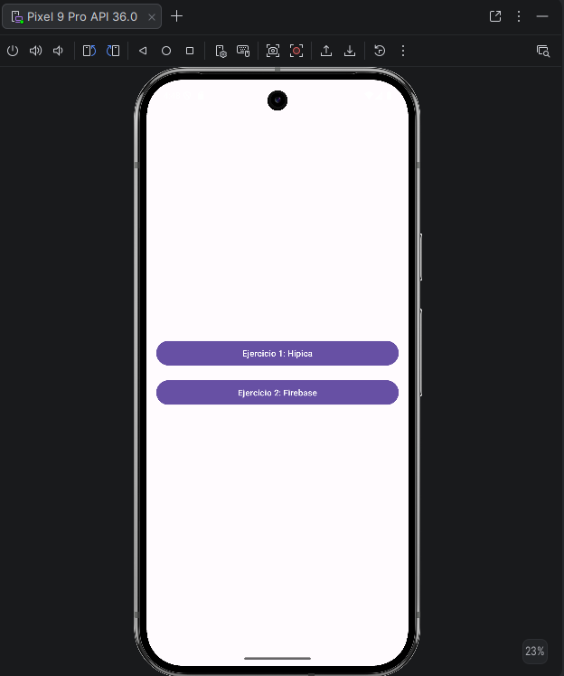
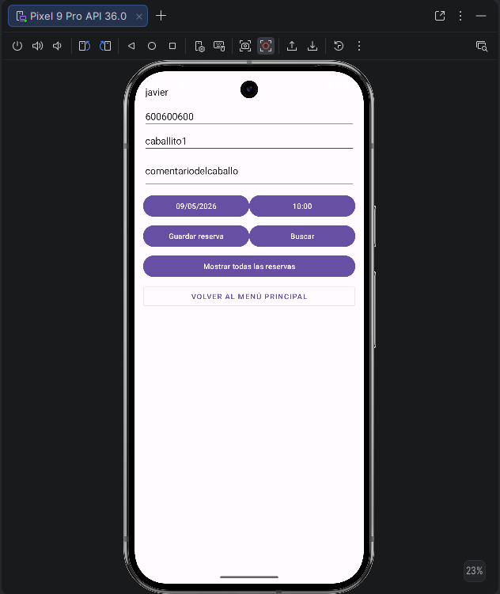
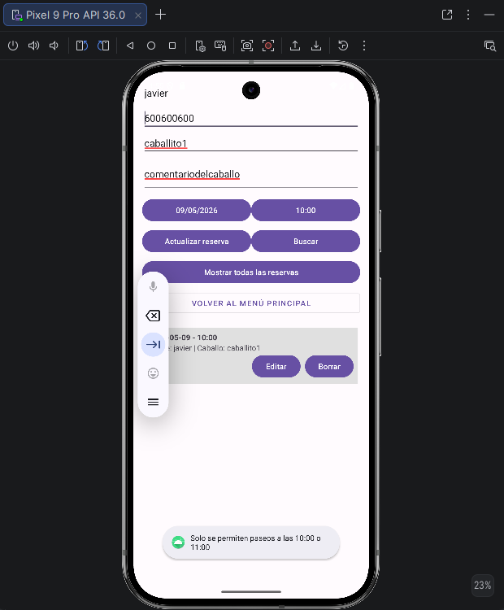
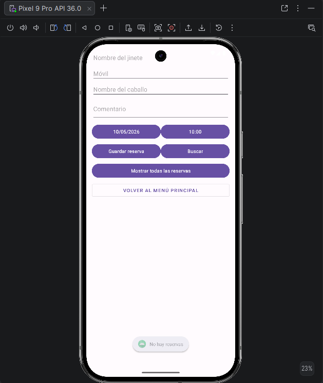
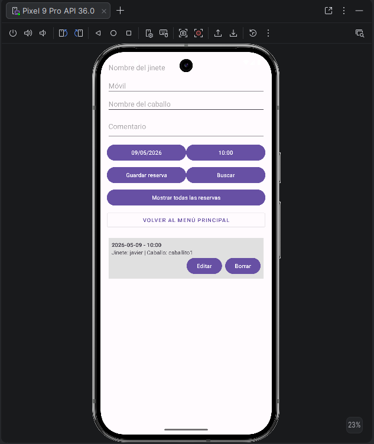
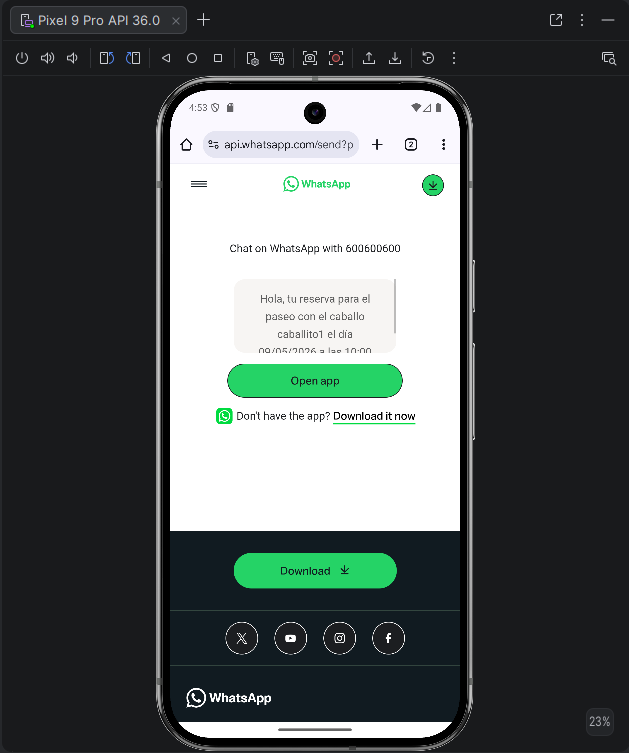

# Tarea 3: Reserva de Hípica y Gestión de Herramientas de IA

Este proyecto es una aplicación Android desarrollada en Kotlin que integra dos funcionalidades principales divididas en ejercicios, demostrando el uso de persistencia local con **Room** y servicios en la nube con **Firebase**.

## 🚀 Características Principales

### Ejercicio 1: Gestión de Reservas de Hípica (Room)
Sistema de gestión de paseos a caballo con las siguientes características:
- **Persistencia Local**: Uso de Room Database para almacenar reservas de forma permanente en el dispositivo.
- **Validaciones**: 
  - Solo se permiten reservas en **sábados y domingos**.
  - Horarios restringidos exclusivamente a las **10:00 o 11:00**.
- **Operaciones CRUD**: Permite insertar, visualizar, editar y eliminar reservas.
- **Búsqueda Avanzada**: Filtrado de reservas por fecha y hora exactas.
- **Integración con WhatsApp**: Envío automático de un mensaje de confirmación al móvil del jinete tras realizar la reserva.
- **Arquitectura MVVM**: Separación clara de responsabilidades usando ViewModels, Repositorios y Flow para actualizaciones en tiempo real.

### Ejercicio 2: Gestión de Herramientas de IA (Firebase)
Gestor de herramientas en la nube sincronizado para cada usuario:
- **Autenticación**: Registro e inicio de sesión seguro mediante **Firebase Auth**.
- **Base de Datos NoSQL**: Almacenamiento y sincronización en tiempo real con **Firebase Firestore**.
- **Gestión Personalizada**: Cada usuario solo puede ver y gestionar sus propias herramientas de IA.
- **Categorización**: Clasificación de herramientas por tipos (Asistentes, Video, Imágenes, etc.).

---

## 🛠️ Tecnologías Utilizadas

- **Kotlin**: Lenguaje de programación principal.
- **Android Gradle Plugin (AGP) 9.2.1**: Gestión del ciclo de vida de construcción.
- **Room Persistence Library**: Abstracción sobre SQLite para datos locales.
- **KSP (Kotlin Symbol Processing)**: Procesamiento de anotaciones de Room (versión 2.2.10-2.0.2).
- **Firebase**:
  - **Firebase Authentication**: Gestión de usuarios.
  - **Cloud Firestore**: Base de Datos en tiempo real.
- **Corrutinas y Flow**: Manejo de operaciones asíncronas y reactividad.
- **Material Design 3**: Interfaz de usuario moderna y adaptativa.

---

## 📂 Estructura del Proyecto

- `MainActivity.kt`: Menú principal de acceso a los dos ejercicios.
- `Main1Activity.kt`: Lógica de la hípica y validaciones de fecha/hora.
- `Main2Activity.kt`: Flujo de login y registro en Firebase.
- `HerramientasActivity.kt`: Gestión de datos en Firestore.
- `ReservaViewModel.kt`: Gestión del estado de la UI y comunicación con el repositorio.
- `ReservaDatabase.kt`: Configuración de Room con patrón Singleton.

---

## 🛠️ Configuración y Requisitos

1. **Java 17**: Requerido por la versión 9.x de AGP.
2. **Android Studio Meerkat** (o superior): Recomendado para total compatibilidad.
3. **google-services.json**: Asegúrate de tener el archivo de configuración de tu proyecto Firebase en la carpeta `app/`.
---

## 🖼️ Capturas de Pantalla

### Menú Principal

### Ejercicio 1: Reservas Hípica

